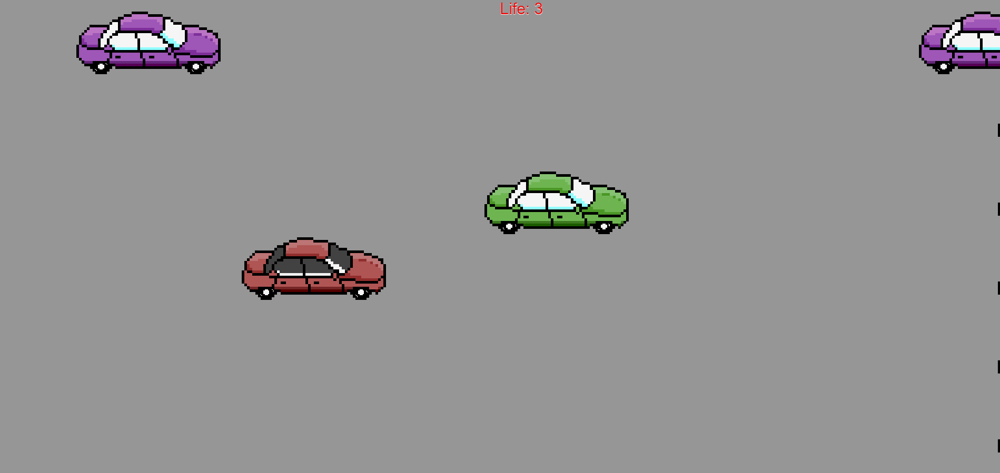

# CarGame
Drive car down the highway.

This is a project where I learned to incorporate animations into a webpage using JavaScript.

In this game, you are driving a car very fast down the highway.
The car follows the position of your cursor.
If you hit another car, your car will get damaged. If you hit too many cars, you will total your car and will have to get towed.
